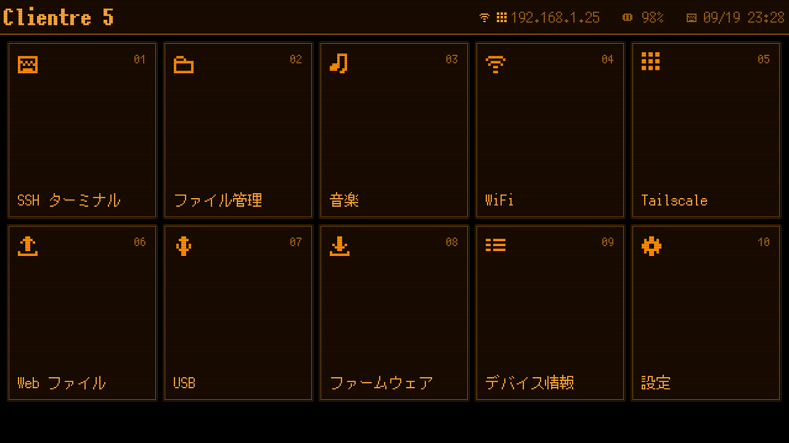
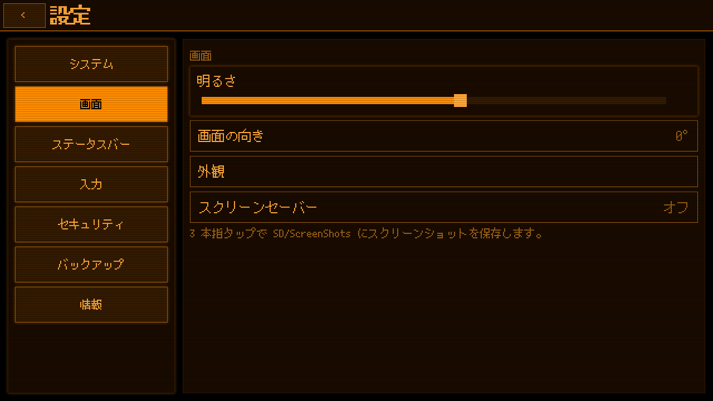
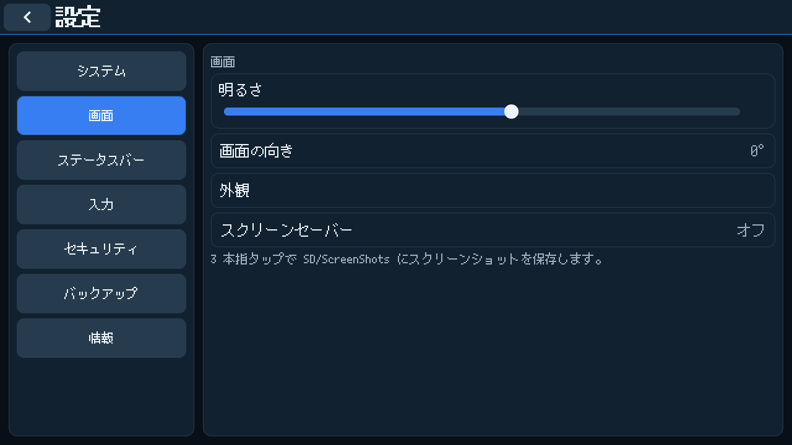

# Clientre 5

**English** | [日本語](README_ja.md)

A pocket SSH terminal OS for the [M5Stack Tab5](https://docs.m5stack.com/en/core/Tab5) (ESP32-P4).
Clientre 5 turns the Tab5 into a standalone terminal with a physical-keyboard-first UI,
Japanese input, a Tailscale client, and a small set of file and media tools.



## Features

- **SSH terminal**: VT100 / xterm-256color emulator with scrollback and double-width CJK
  characters. Password, public-key and keyboard-interactive auth; host keys are pinned
  on first connect.
- **Japanese input**: romaji to kana, SKK dictionary kana-kanji conversion (SKK-JISYO.M
  built in, SKK-JISYO.L loadable from the TF card). Chinese pinyin is available when the UI
  is in Chinese. Switch sources with `Ctrl+Space` or the `A/あ` key.
- **Tailscale**: joins your tailnet with the bundled [MicroLink](https://github.com/Csontikka/microlink)
  client, so you can SSH to tailnet hosts by name. Headscale is supported.
- **Keyboard-first**: the Tab5 keyboard or any USB keyboard drives the whole UI
  (Tab / arrows / Enter / Esc); a soft keyboard is there when you have neither.
- **Files and media**: TF card and USB-stick file manager, JPEG/PNG/BMP/GIF viewer with EXIF,
  UTF-8/UTF-16 text viewer, MP3/FLAC/WAV player with background playback, and a camera
  that saves JPEGs to the card.
- **Web Files**: browse, upload and download the TF card from a browser over WiFi.
- **USB disk mode**: expose the TF card to a PC over USB-C.
- **OTA updates**: check, download and install new firmware from the device.
- **Appearance**: Orange EL (default), Retro CRT, Pixel, Dark, Light, Nord, Solarized Dark,
  Gruvbox and Classic themes, each fully customisable, including the terminal's 16-colour palette.
- **Security**: SSH passwords and keys are encrypted at rest with AES-256-GCM; the server list can
  be kept on the TF card, encrypted with a key that never leaves the device. Encrypted backups.
- **Languages**: English, 日本語, 简体中文, 繁體中文.

<p>
  
  
</p>

*Screenshots are host renders of the firmware UI (see [ui_preview](firmware/tools/ui_preview/README.md)).*

## Hardware

| | |
|---|---|
| Device | M5Stack Tab5 (board v3 tested) |
| SoC | ESP32-P4, ESP32-C6 for WiFi over SDIO |
| Memory | 16 MB flash, 32 MB PSRAM |
| Display | 1280 × 720 MIPI-DSI touchscreen |
| Optional | Tab5 keyboard, USB keyboard, TF card |

## Status

Verified on a physical Tab5: display, touch, keyboards, WiFi, SSH (including over Tailscale),
Japanese input and USB disk mode. Audio playback and OTA installation have not been fully
verified yet.
Bug reports are welcome.

Known limitation: large or many uploads through Web Files can be unreliable because of the
ESP32-P4 ↔ C6 SDIO link. USB disk mode is the dependable way to move big files.

## Build and flash

Requires [ESP-IDF v5.5](https://docs.espressif.com/projects/esp-idf/en/v5.5/esp32p4/get-started/)
with the esp32p4 target.

```sh
git clone https://github.com/Mozgi512/Clientre5.git
cd Clientre5/firmware
idf.py set-target esp32p4
idf.py build
(cd updater && idf.py set-target esp32p4 && idf.py build)
sh tools/merge_flash.sh        # -> release/full/clientre5_full_flash.bin
python -m esptool --chip esp32p4 -p PORT --baud 1500000 write_flash \
  --flash_mode dio --flash_size 16MB --flash_freq 80m \
  0x0 release/full/clientre5_full_flash.bin
```

When a release is published, you can skip the build and flash `clientre5_full_flash.bin`
from the [Releases](https://github.com/Mozgi512/Clientre5/releases) page at `0x0`.

The partition layout (app at `0x20000`, updater at `0xF80000`) is compatible with
[bmorcelli/Launcher](https://github.com/bmorcelli/Launcher). When started from Launcher,
update through Launcher rather than the in-app OTA.

See [firmware/README.md](firmware/README.md) for the source layout, per-partition flashing,
font and dictionary generation, and implementation notes.

## Documentation

- [Quick start (English)](docs/quick-start.md)
- [クイックスタート（日本語）](docs/quick-start.ja.md)
- [Firmware internals](firmware/README.md)

## Repository layout

```text
├── firmware/            ESP-IDF project
│   ├── main/            application (UI, terminal, SSH, IME, media, network, OTA)
│   ├── updater/         factory-partition updater used by OTA
│   ├── components/      vendored libssh, MicroLink, wireguard-lwip
│   └── tools/           font / icon / dictionary generators, release script, UI preview
├── cad/                 STEP models: modified battery case, JIS keyboard (CC BY 4.0)
└── docs/                user guides and UI renders
```

## License

Clientre 5's own code (`firmware/main`, `firmware/updater`, `firmware/tools`) is released under the
[MIT License](LICENSE). Bundled third-party components keep their own licenses:

| Component | License |
|---|---|
| [libssh](https://www.libssh.org/) (via ewpa/LibSSH-ESP32) | LGPL-2.1 |
| [MicroLink](https://github.com/Csontikka/microlink) | MIT |
| [wireguard-lwip](https://github.com/smartalock/wireguard-lwip) | BSD-3-Clause |
| [LVGL](https://lvgl.io/) | MIT |
| ESP-IDF and Espressif components | Apache-2.0 |
| SKK-JISYO.M (dictionary data) | GPL-2.0-or-later |
| x12y12pxMaruMinya by hicc (generated bitmap subset; the TTF is not included) | free, commercial use, modification and embedding permitted |
| Noto Sans CJK, DejaVu Sans Mono (generated font data) | OFL-1.1 / Bitstream Vera |

Firmware binaries therefore include LGPL and GPL-licensed parts; the complete source is in this
repository.

The CAD data in [`cad/`](cad/README_en.md) is released under
[CC BY 4.0](https://creativecommons.org/licenses/by/4.0/).
