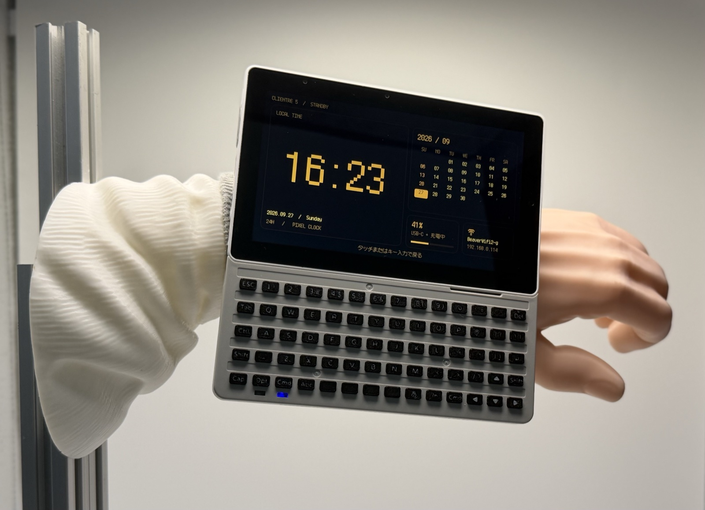

# CAD データ

**日本語** | [English](README_en.md)

M5Stack Tab5 で Clientre 5 を使うためのハードウェアの 3D モデルです。

| ファイル | 内容 |
|---|---|
| [Tab5_battery_case.step](Tab5_battery_case.step) | Tab5 用に改造したバッテリーケース（単一ボディ） |
| [Tab5_keyboard_JIS.step](Tab5_keyboard_JIS.step) | JIS 配列にカスタマイズした Tab5 キーボード（複数ボディ） |

- 形式: STEP AP214（Autodesk Fusion から書き出し）。単位は mm です。
- 非公式のパーツです。M5Stack と Tab5 は M5Stack Technology Co., Ltd. の商標で、
  同社はこれらのモデルを保証・サポートしていません。
- 印刷・加工の前に、お手元の実機で寸法を確認してください。無保証です。

## バッテリーケース

> [!CAUTION]
> リチウムイオン電池の改造はショート・発火・破裂のおそれがあり、大変危険です。
> 作業も使用も **自己責任** で行ってください。

このケースを使うには、NP-F バッテリーの改造が必要です。

1. NP-F バッテリーを分解し、基板部分だけを残します。
2. NP-F のケースを、Tab5 の電池スロットと同じ高さまで削ります。
3. 元の 18650 × 2（直列）を基板から切り離します。
4. 18500 × 2 を直列にし、元の接続と同じように **+・−・真ん中** の 3 か所を基板につなぎます。

- 2 本は同じ型番で、電圧をそろえたセルを使ってください。
- 作業中は端子同士や工具でショートさせないよう注意してください。

## キーボード

- カスタムボタンの印刷には **0.2 mm ノズル** が必要です。
- キーボードを分解するときは、爪の部分のばねを飛ばさないように注意してください。

## ライセンス

このディレクトリの CAD データは
[クリエイティブ・コモンズ 表示 4.0 国際（CC BY 4.0）](https://creativecommons.org/licenses/by/4.0/deed.ja)
で公開しています。クレジットを表示すれば、商用を含めて共有・改変できます。

> Clientre 5 CAD data by Mozgi512 (https://github.com/Mozgi512/Clientre5), CC BY 4.0

リポジトリのその他の部分は、それぞれのライセンスに従います（トップの [README](../README.md#ライセンス) を参照）。
