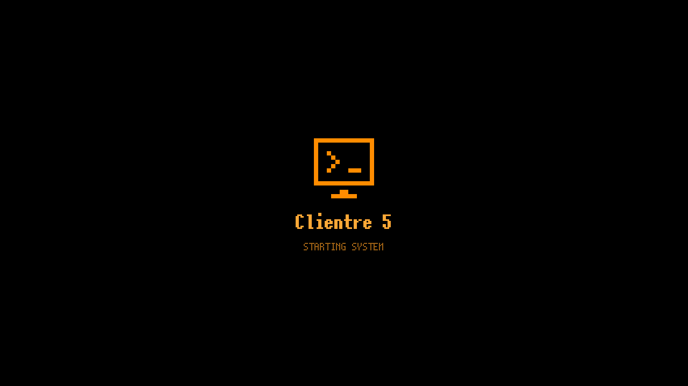

# Clientre 5 firmware (source)

Source tree of Clientre 5, a pocket SSH terminal OS for the M5Stack Tab5 (ESP32-P4),
built on ESP-IDF v5.5 + LVGL 9. This document covers the build and the implementation
details; see the [top-level README](../README.md) for an overview.

> Status: verified on a physical Tab5 (board v3): display, touch, keyboard, WiFi, SSH over a
> Tailscale tailnet, Japanese input, and USB disk mode. Audio playback and the OTA path are
> still unverified.

## Layout

```
firmware/
├── main/
│   ├── app_main.c            boot: BSP, display, SD, WiFi, USB, IME, UI
│   ├── i18n/                 EN / 简体中文 / 繁體中文 / 日本語 string table
│   ├── fonts/                generated LVGL fonts (MaruMinya, Noto/DejaVu fallback)
│   ├── ime/                  input method: romaji→kana, SKK dictionary, pinyin, candidate bar
│   ├── input/                Tab5 I2C keyboard (0x6D, HID mode) + USB HID keyboard, key routing
│   ├── term/                 VT100/xterm-256color emulator (wide chars, scrollback), LVGL renderer
│   ├── ssh/                  libssh client task (password / key / keyboard-interactive, host keys in NVS)
│   ├── ui/                   screens: home, servers, terminal, files, image, text, music, camera,
│   │                         wifi, settings, OTA, device info, USB, web files, backup, screensaver
│   ├── media/                JPEG loader (HW decoder + scaled SW), EXIF, audio player (MP3/FLAC/WAV), camera
│   ├── net/                  WiFi manager over esp_wifi_remote (ESP32-C6 via SDIO)
│   ├── storage/              SD/FAT helpers, encrypted/plain backup
│   ├── web/                  HTTP file manager (/webfm) + embedded HTML
│   ├── ota/                  manifest check, download to SD, install via updater
│   ├── sys/                  INA226 power, RX8130 RTC, NTP, screenshot, USB host/device manager
│   ├── crypto/               AES-256-GCM secure store, PBKDF2 backups
│   └── servers/              SSH server list (passwords encrypted at rest)
├── components/libssh/        libssh 0.11 (LGPL-2.1) from ewpa/LibSSH-ESP32, no Arduino dependency
├── components/microlink/     MicroLink v2 (MIT) unofficial Tailscale client + components/wireguard_lwip
├── updater/                  tab5_factory_updater: flashes main_app from /sdcard/update
├── tools/                    font / icon / dictionary generators, release script, host UI preview
├── partitions.csv            Launcher-compatible layout (main_app @0x20000, factory @0xF80000)
└── sdkconfig.defaults
```

## Build

Requirements: ESP-IDF **v5.5** with the esp32p4 toolchain, network access for the component registry.

```sh
cd firmware
idf.py set-target esp32p4
idf.py build
cd updater && idf.py set-target esp32p4 && idf.py build && cd ..
sh tools/merge_flash.sh            # -> firmware/release/{partitions,full,update.json}
```

Flash the merged image at `0x0`:

```sh
python -m esptool --chip esp32p4 -p PORT --baud 1500000 write_flash --flash_mode dio --flash_size 16MB --flash_freq 80m 0x0 release/full/clientre5_full_flash.bin
```

Or flash the parts individually:

| Offset | File |
|---|---|
| `0x2000` | `partitions/bootloader.bin` |
| `0x8000` | `partitions/partition_table.bin` |
| `0xF000` | `partitions/ota_data_initial.bin` |
| `0x20000` | `partitions/clientre5.bin` |
| `0xF80000` | `partitions/tab5_factory_updater.bin` |

During development `idf.py -p PORT flash monitor` flashes the bootloader, partition table
and app; flash `tab5_factory_updater.bin` at `0xF80000` once so that in-app OTA can install.

## Product identity

The product name is **Clientre 5** in all UI languages, the boot logo, Web Files,
USB descriptor, backup metadata and startup logs. The ESP-IDF project (and so the
app descriptor checked by OTA) is `clientre5`, and the default Tailscale node name
for new configurations is `clientre5`.

## Boot logo

A static pixel terminal mark and `Clientre 5 / STARTING SYSTEM` appear as soon
as LCD/touch setup and display rotation are ready, before secure storage, RTC,
SD, server data and input/network/media initialization. The logo uses the saved
palette and backlight brightness. It cannot cover the bootloader or the LCD
hardware initialization that happens before a framebuffer is available.

The splash needs no SD asset, image decoder, animation timer or minimum display
time: a 32-byte monochrome mark and existing flash fonts are drawn once. The
main screen (or first-run language picker) replaces it as soon as service
initialization returns; it does not wait for WiFi or Tailscale to connect. Input
navigation and the screensaver are enabled only at that handoff.

The extra work is screen creation and one framebuffer draw, not a deliberate
boot delay. Serial logs report `boot logo submitted in ... ms` and
`boot complete in ... ms` for measurement on the board. Actual added latency
has not been measured on hardware.



## Japanese input

* **Switching the input source**: `Ctrl+Space` on a physical keyboard, the `A/あ` key on the
  soft keyboard, or the `A/あ` button in the terminal control bar. The order is
  English → Japanese → (Chinese pinyin, only when the UI language is Chinese) → English.
  The current source is shown in the terminal status bar and on the soft keyboard.
* **Typing**: romaji is converted to hiragana as you type (`kyou` → きょう, `nn`/`n'` → ん,
  doubled consonants → っ). `Space` converts using the SKK dictionary; `Space`/`↓` cycles
  candidates, `1`–`9` picks from the current page, `Enter` commits, `Esc` cancels,
  `F7` commits as katakana, `F8` as half-width katakana, `F6` as hiragana. Anything committed is
  sent to the remote host
  as UTF-8 (bracketed paste is honoured when the remote enables it).
* **Dictionaries**: SKK-JISYO.M is built in. Put `SKK-JISYO.L` (EUC-JP or UTF-8) at
  `/skk/SKK-JISYO.L` on the TF card and enable *SD dictionary* in Settings to use it (loaded into PSRAM).
* **Display**: the terminal font covers every JIS X 0208, GB2312 and Big5 character plus
  JIS X 0213 levels 3/4, half-width kana, compatibility ideographs and the squared unit forms;
  wide characters occupy two cells like a real terminal. The UI fonts carry all the translated
  text natively, so no label falls back to the monospace font for its size.

## Tailscale (tailnet SSH)

The **Tailscale** tile joins the device to your tailnet using the vendored, unofficial
[MicroLink](https://github.com/Csontikka/microlink) client (`components/microlink`, MIT):
ts2021 control protocol, WireGuard, DERP relay, DISCO/STUN. The WireGuard netif owns
`100.64.0.0/10` in lwIP, so libssh connects to peers with ordinary sockets.

1. Create an auth key at `login.tailscale.com/admin/settings/keys` (reusable + pre-authorized is easiest).
2. Enter it on the Tailscale screen, or put it in `/tailscale/authkey.txt` on the TF card and tap *Load key from SD*.
3. Turn on *Join tailnet*. Once connected, the peer list shows every node; tap one to add it as an SSH server.
   Server hosts may be tailnet names (`nas`, `nas.tailxxxx.ts.net`); they are resolved from the peer list at connect time.
4. Headscale/Ionscale: set *Control server* to your server URL.

Node keys persist in NVS, so the auth key is only needed once. *Forget this node* wipes them.

**Relay-only by default.** MicroLink's direct-path (DISCO) upgrade can black-hole traffic behind
strict NAT (ping answered, WireGuard data not), so the firmware keeps every peer on DERP unless
*Direct connections (experimental)* is switched on. Expect ~50–150 ms extra latency. Before opening
the SSH socket the firmware moves its DERP connection to the peer's home region, wakes the
WireGuard session and waits for it; first connection to a peer can take 5–30 s.

**Tailscale SSH targets** (`SSH-2.0-Tailscale` banner) authenticate by tailnet identity: leave the
password empty. Their default ACL rule is `"action": "check"`, which needs a browser confirmation
the Tab5 cannot do. Tag the device and add an `accept` rule, e.g.:

```jsonc
"tagOwners": { "tag:tab5": ["autogroup:admin"], "tag:server": ["autogroup:admin"] },
"ssh": [
  { "action": "accept", "src": ["tag:tab5"], "dst": ["tag:server"], "users": ["autogroup:nonroot", "root"] },
  { "action": "check",  "src": ["autogroup:member"], "dst": ["autogroup:self"], "users": ["autogroup:nonroot", "root"] }
]
```
then apply `tag:tab5` to the Tab5 and `tag:server` to the target in the Machines page (SSH rules
cannot use `autogroup:member` or a user as `dst` when the source is a tag).

## Regenerating fonts / dictionaries

`gen_pixel_fonts.sh` reads `x12y12pxMaruMinya.ttf` from the repository root by default
(not committed: the font's terms allow embedding but the TTF itself is obtained from its
author, hicc), or accepts a TTF path. `gen_fonts.sh` needs `NotoSansMonoCJKjp-Regular.otf` and
`DejaVuSansMono.ttf` in the supplied directory.

```sh
npm i lv_font_conv                                  # once
pip3 install fonttools                              # once
sh tools/gen_pixel_fonts.sh              # the UI and terminal faces
sh tools/gen_fonts.sh       <font dir> [SKK-JISYO.M]  # the CJK/symbol fallback
python3 tools/skk2bin.py skk    SKK-JISYO.M main/ime/dict/skk_m.bin
python3 tools/skk2bin.py pinyin managed_components/lvgl__lvgl/src/widgets/ime/lv_ime_pinyin.c main/ime/dict/pinyin.bin
```

`cjk_ranges.py` intersects the wanted blocks with the font's cmap and routes whatever Noto Sans
CJK lacks to DejaVu Sans Mono, which `mono_match.py` rescales so a fallback glyph still advances
exactly one terminal cell. The title face is a subset taken from `i18n_chars.py`, which walks
all of `main/` and (with `--font`) drops the characters the face does not have -- run
`gen_pixel_fonts.sh` again after adding translated strings. LVGL draws a hollow rectangle for any
character missing from the whole fallback chain, so a box on screen means a gap in these ranges.

## Appearance, gestures and credential storage

The retro themes use **x12y12pxMaruMinya** by hicc. Its 12px grid is
rendered at exact integer scales: 24px for body, secondary text and the terminal,
and 36px for titles, at 1 bpp. Terminal ASCII advances 12px and Japanese 24px;
the default 32px row height adds 4px of space above and below the 24px font box.
Legacy generated C names (`font_px20`, `font_px24`, `font_px36b`) are retained.

MaruMinya does not cover simplified or traditional Chinese, so Chinese selects the
anti-aliased Noto CJK face for the entire UI and terminal instead of mixing faces in
one sentence. Dark, Light, Nord, Solarized, Gruvbox and Classic also select smooth
fonts: Montserrat for English UI and Noto CJK for Japanese/Chinese, with Noto Mono CJK
in the terminal. `⏵` has a dedicated single-cell glyph.
The LVGL icon glyphs use
original 8x8 pixel pictograms (16 px for controls, 32 px for home tiles). Smooth
icon glyphs remain available in the non-pixel themes.

*Settings > Display > Appearance* treats a theme as a whole look rather than a palette:
the eight colours, corner rounding, padding density, accent-tinted home tiles, the luminous edges
of cards and the CRT scan lines, plus the terminal's foreground, background, cursor and
16-colour ANSI palette. **Orange EL** is the default -- black glass, amber text, square
corners, a thin accent halo and a 1-in-4-pixel scan line drawn after the children of every
screen. **Retro CRT** is the green-phosphor equivalent and **Pixel** a squared-off 8-bit
palette; Dark, Light, Nord, Solarized Dark and Gruvbox stay for a plain look.
**Classic** uses blue-grey panels, blue actions and rounded controls.
Saved preset indexes and user colour settings are retained across updates. The `UI_*`
colour macros resolve through `ui_theme_color()`, so widgets follow a theme change without
touching their call sites, and the hardcoded radius and padding values go through
`ui_theme_radius()` / `ui_theme_pad()`.

EL/pixel navigation keeps the new screen stationary and passes a faint excitation
band over it for 360 ms, with a broad fading tail. Only the band's old/new bounds
are redrawn at a nominal 30 Hz; late frames skip ahead using elapsed time. The
scan-line texture itself stays static. Disabling **Glow** also disables the sweep.
Classic and the other smooth themes use the standard screen transitions. The glow
uses narrow outlines instead of blurred shadow masks; button feedback uses a
40 ms excitation and 120 ms colour decay without growing or shrinking glyphs.
Settings categories switch existing panels and retain each panel's scroll
position, without rebuilding the whole screen. Status text is updated only when
its content changes.

Settings uses a left category menu and a right content panel. Home
tiles adapt to landscape/portrait and spacing preferences, with numbered pixel
icons. Shared LVGL styles cover buttons, inputs, switches, sliders, checkboxes and
scrollbars; the keyboard, IME, media controls, terminal toolbar and notifications
use the active palette. Photographs, QR codes, user-selected colours and terminal
colour overrides retain their content colours. A home long press now runs only
its shortcut, without also opening the tile.

Choose **Settings → Display → Appearance → Theme → Orange EL / Classic**.
Existing installations keep their saved theme. Restore appearance defaults or
select Orange EL to adopt the amber look.


These are host renders of the firmware UI with simulated hardware status, not
photographs of the device. See [UI preview](tools/ui_preview/README.md) for the
reproducible renderer and theme/navigation checks. `tools/gen_ui_icons.py`
regenerates the committed pictogram fonts without external font downloads.

Gestures are taken from the input device rather than from the widget tree: LVGL only walks
up from the touched object while every object in between has `LV_OBJ_FLAG_GESTURE_BUBBLE`,
which does not survive cards, lists and buttons. `ui_core.c` installs one handler on the
pointer indev and dispatches by active screen. The default is swipe right to go back;
screens that need the horizontal axis (image viewer, music, terminal) install their own with
`ui_screen_set_gesture()`. Long-pressing a home tile runs a shortcut, and the terminal has a
long-press menu.

*Settings > Security > Keep SSH servers on the TF card* encrypts the whole server list --
hosts, user names, key paths and passwords -- with the device key and writes it to
`/sdcard/.tab5/servers.enc`, erasing the NVS copy. The key stays in NVS, so neither the card
nor the device on its own can read the list back. Without the card the list starts empty and
returns when the card does. WiFi credentials and the Tailscale auth key still live in NVS.

## USB disk mode

The USB screen hands the TF card to the PC as a USB drive. Two ESP32-P4 details shape how this
works:

* The host library always takes the high-speed OTG controller (`usb_host.c` hardcodes the UTMI
  PHY on this target), which is the USB-A receptacle. The device stack therefore runs on the
  full-speed controller, so **USB host mode keeps working** -- a USB keyboard stays live while
  the card is exposed.
* `LP_SYS.usb_ctrl` decides which of the two internal full-speed PHYs each controller gets.
  By default the USB-Serial-JTAG owns PHY 0, which is where the Tab5's USB-C data lines are;
  OTG 1.1 gets PHY 1, which is not wired to anything. `usb_mgr.c` swaps the two for the duration
  of disk mode, so **the serial console and flashing are unavailable until disk mode is stopped**
  (press Stop on screen, or power-cycle).

`CONFIG_TINYUSB_MSC_BUFSIZE` must stay at or below 8128 bytes. The MSC class hands its whole
buffer to a single dwc2 transfer and `dcd_dwc2.c` writes the packet count into DIEPTSIZ/DOEPTSIZ
without clamping it to what the core implements; OTG 1.1 has a 7-bit packet count, so 64-byte
full-speed bulk packets cap a transfer at 127 packets. A 32 KB buffer asks for 512 packets, which
truncates to exactly 0 -- control transfers keep working, enumeration succeeds, and every bulk
transfer silently never completes until the host gives up 30 s later and resets the port.

The TinyUSB task runs at priority 10: at its default of 5 it loses the CPU to MicroLink's
`ml_wg_mgr` (priority 7 on the same core) and the host answers late transfers with a port reset.

## OTA manifest

The Firmware screen fetches the JSON at *Settings → Update URL* (default:
`update.json` on the `main` branch of this repository). `tools/merge_flash.sh` writes a
matching `update.json` whose binary URLs point at the latest GitHub release assets
(override with `REPO_RAW=...`); commit the manifest and attach `clientre5.bin` and
`tab5_factory_updater.bin` to the release.
Installation writes `/sdcard/update/request.json`, switches the boot partition to the factory
updater and reboots; the updater verifies the SHA-256 and flashes `main_app`.

## Licenses

libssh (LGPL-2.1), MicroLink / wireguard-lwip (MIT), LVGL (MIT), MaruMinya (source TTF copyright © 2023 hicc), Noto Sans CJK (OFL-1.1), DejaVu Sans Mono (Bitstream Vera / Arev, permissive),
SKK-JISYO (GPL-2.0, data only),
ESP-IDF components (Apache-2.0). Application code in `main/` and `updater/`: MIT (see [LICENSE](../LICENSE)).
